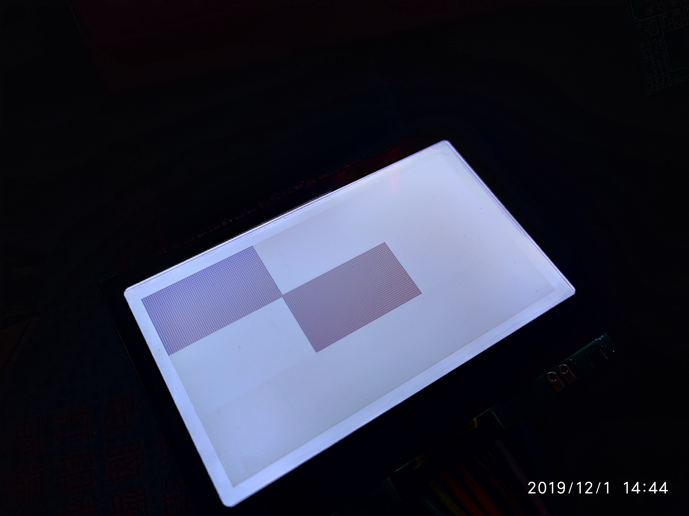

# LCD_ST75256_192x96

> `RaspberryPI LCD Driver for JLX19296G-382-PN With ST75256`





> USAGE

```bash
Usage: ./main <file-path>...
Options:
  -h,--help  -- Show this help message.
  -f FILE_PATH,--file=FILE_PATH -- Lcd Movie Player File.
  -l LOOP_TIMES,--loop=LOOP_TIMES -- Loop Number Of Times.
```

> Example

```bash
# time ./main -f nokia_lumia_925.mp4_170x96_25fps_875frame_2bit.bin -l 2
DEBUG: [main:98] MSG:Play Movie [nokia_lumia_925.mp4_170x96_25fps_875frame_2bit.bin] Loop Times [2].
DEBUG: [bmp_debug:42] MSG:video_width[1920]
DEBUG: [bmp_debug:43] MSG:video_height[1080]
DEBUG: [bmp_debug:44] MSG:lcd_width[170]
DEBUG: [bmp_debug:45] MSG:lcd_height[96]
DEBUG: [bmp_debug:46] MSG:video_fps[25]
DEBUG: [bmp_debug:47] MSG:video_frame[875]
DEBUG: [bmp_debug:48] MSG:pixel_bit[2]
DEBUG: [bmp_debug:49] MSG:video_fps[25]
DEBUG: [bmp_debug:51] MSG:IMG_FRAME_WIDTH[24]
DEBUG: [bmp_debug:52] MSG:IMG_FRAME_LEN[4080]
DEBUG: [bmp_debug:53] MSG:IMG_FILE_LEN[3570000]
DEBUG: [bmp_debug:54] MSG:IMG_FRAME_WIDTH[24]
DEBUG: [bmp_show:209] MSG:Waiting [40]ms ...
DEBUG: [bmp_show:209] MSG:Waiting [48]ms ...
DEBUG: [bmp_show:209] MSG:Waiting [48]ms ...
......
DEBUG: [main:115] MSG:Play Movie [nokia_lumia_925.mp4_170x96_25fps_875frame_2bit.bin] End.

real    1m10.859s
user    0m28.837s
sys     0m0.110s
```